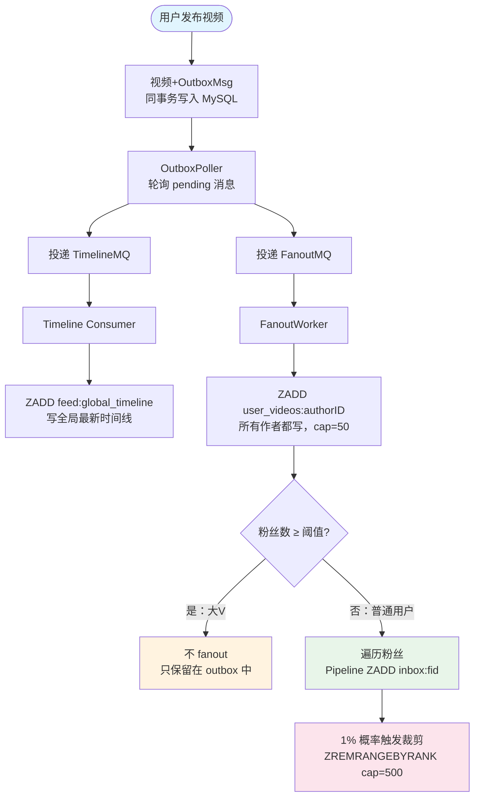
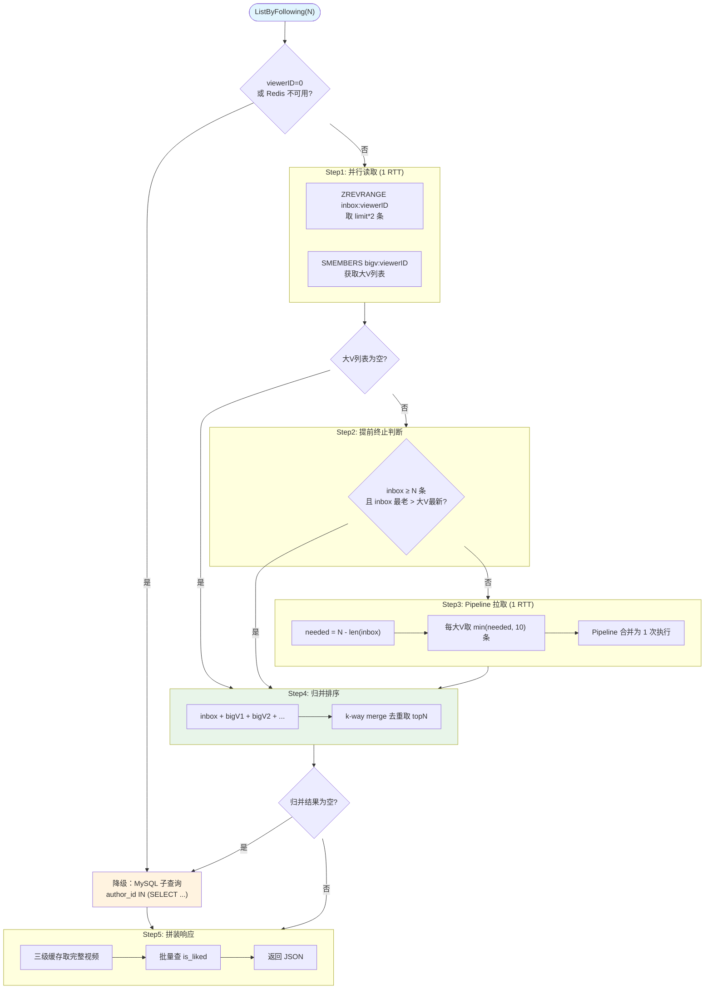

# Feed 流推拉结合优化文档

## 一、优化背景

### 1.1 原有问题

优化前，`ListByFollowing` 接口采用**纯拉模式**（fanout-on-read）：

```sql
SELECT * FROM videos
WHERE author_id IN (SELECT vlogger_id FROM socials WHERE follower_id = ?)
  AND create_time < ?
ORDER BY create_time DESC
LIMIT ?
```

**问题**：
- 每次请求都执行子查询，随着关注数量增长，查询性能线性下降
- 社交关系表无缓存，每次读取都走 MySQL
- 没有区分大V和普通用户，所有关注者一视同仁

### 1.2 优化目标

实现**推拉结合**（Push-Pull Hybrid）模式：
- **普通用户**（粉丝 < 阈值）：发布视频时 fanout-on-write，推送到所有粉丝收件箱
- **大V**（粉丝 >= 阈值）：不推送，读取时 fanout-on-read，从发件箱拉取
- 读取时两路数据归并排序，对用户无感知

---

## 二、架构设计

### 2.1 写入路径



### 2.2 读取路径



### 2.3 各场景开销

| 场景                   | Redis次数 | 网络RTT | 说明                              |
|------------------------|----------|---------|-----------------------------------|
| 未登录或Redis不可用    | 0        | 0       | 直接降级MySQL子查询               |
| 没关注大V              | 2        | 1       | SMEMBERS返回空，跳过拉取          |
| inbox够用且所有大V无新内容 | 3    | 2       | Pipeline批量探测所有大V最新时间戳取max，确认无需拉取 |
| inbox不够，需要拉取    | 3        | 2       | 探测+拉取合并为1次Pipeline RTT    |
| 归并结果为空           | 3        | 2       | 降级MySQL子查询兜底               |

> **注意**：上述"采样1个大V"的旧逻辑已更新为"Pipeline批量查所有大V最新时间戳取max"（公平提前终止）。不管关注了多少大V，Redis网络RTT恒定约3次（并行读取 + Pipeline探测 + Pipeline拉取），不随大V数量增长。

---

## 三、Redis Key 设计

| Key | 类型 | TTL | 用途 |
|-----|------|-----|------|
| `inbox:{userID}` | ZSET | 无(cap 控制) | 用户收件箱，score=createTime 毫秒，cap 500 |
| `user_videos:{authorID}` | ZSET | 24h | 作者发件箱，score=createTime 毫秒，cap 50 |
| `following:bigv:{followerID}` | SET | 24h | 用户关注的大V ID 集合 |
| `user:follower_count:{userID}` | STRING | 无(⚠️) | 用户粉丝数缓存，FanoutWorker 判断大V用 |
| `user:active:{userID}` | STRING | 72h | 登录时写入，FanoutWorker 过滤僵尸粉用 |

---

## 四、修改文件清单

### 4.1 Entity 变更

**`internal/account/entity.go`** — Account 新增 `FollowerCount` 字段

```go
FollowerCount int64 `gorm:"column:follower_count;not null;default:0" json:"follower_count"`
```

**`internal/video/video_entity.go`** — OutboxMsg 新增 `AuthorID` 字段

```go
AuthorID uint `gorm:"index"` // 视频作者 ID，用于 fanout 判断
```

### 4.2 Redis 扩展

**`internal/middleware/redis/zset.go`** — 新增方法：
- `ZCard` — 返回 ZSET 成员数量
- `ZRevRangeWithScores` — 按排名降序返回成员（带分数）
- `GetRedisClient` — 暴露底层 go-redis 客户端（供 Pipeline 使用）

**`internal/middleware/redis/set.go`** — 新建文件，SET 操作：
- `SAdd` — 添加集合成员
- `SRem` — 移除集合成员
- `SMembers` — 获取所有成员

### 4.3 MQ 层

**`internal/middleware/rabbitmq/fanoutMQ.go`** — 新建文件

复用 TimelineMQ 的 exchange (`video.timeline.events`)，使用独立 routing key `video.timeline.fanout` 和独立队列 `video.timeline.fanout.queue`。

**`internal/middleware/rabbitmq/timelineMQ.go`** — binding key 修改

将 `timelineBindingKey` 从 `video.timeline.*` 改为 `video.timeline.publish`，避免 timeline 队列收到 fanout 消息。

### 4.4 Worker 层

**`internal/worker/outboxworker.go`** — 双投递

`StartOutboxPoller` 新增 `*rabbitmq.FanoutMQ` 参数，每条 outbox 消息先投递 TimelineMQ，成功后投递 FanoutMQ，两者都成功才删除记录。

**`internal/worker/fanoutworker.go`** — 新建文件

消费 FanoutMQ 消息，核心逻辑：
1. 写 `user_videos:{authorID}` ZSET（所有作者都写，cap 50）
2. 查询作者粉丝数，判断是否大V
3. 大V → 不 fanout（只写了 outbox）
4. 普通用户 → 分批 fanout 到粉丝 inbox，使用 Redis Pipeline 批量写入

**关键优化**：
- **粉丝活跃度过滤**：只推给 3 天内登录过的粉丝（`user:active:{id}` TTL 72h，登录时写入），用 Pipeline 批量 EXISTS 过滤，僵尸粉不推，走拉路径兜底
- 分块 fanout（每批 100 人），参考 Stream-Framework
- 概率裁剪（1% 概率触发 ZREMRANGEBYRANK），避免每次写入都裁剪
- Pipeline 批量 ZADD，一次网络往返完成所有写入

**`internal/worker/socialworker.go`** — 增强关注/取关逻辑

注入 Redis 依赖后：
- 关注大V → 将 vloggerID 加入 `following:bigv:{followerID}` SET
- 关注普通用户 → 回填被关注者最近视频到 inbox（关注回填）
- 取关 → 从 bigv SET 移除（不清理 inbox，靠自然 cap 淘汰）

**`internal/social/repo.go`** — 新增方法：
- `GetAllFollowerIDs` — 只查 follower_id 列表（不查 account 表）
- `CountFollowers` — COUNT 查询粉丝数

### 4.5 Feed 服务层

**`internal/feed/service.go`** — ListByFollowing 重写

核心改动：
1. 并行读取：inbox 和 bigV 列表通过 goroutine 并行查询，RTT 从 2 次压缩为 1 次
2. 推路径：`ZRevRangeWithScores` 从 `inbox:{viewerID}` 取已推视频
3. 拉路径：`SMembers` 获取关注的大V列表，通过 `Pipeline` 批量从 `user_videos:{bigVID}` 取最近视频
4. 提前终止：inbox 已够 limit 条且最老条目比大V最新还新时，跳过拉路径
5. 动态拉取数量：inbox 有 8 条、limit=10 时，每个大V只取 2 条而非固定 10 条
6. k-way merge：用 `container/heap` 实现多路归并，去重取 top N
7. 降级：Redis 不可用时回退到原有 MySQL 子查询

新增类型和函数：
- `VideoWithTime` — 归并排序中间结构
- `parseZSetWithScores` — 解析 ZSET 带分数结果，支持游标过滤
- `mergeAndDedup` — k-way merge 归并去重
- `videoTimeHeap` — 实现 `heap.Interface` 的最大堆

**读取优化**：
- **并行读取**：inbox 和 bigV 列表 goroutine 并行，串行 2 次 RTT → 并行 1 次 RTT
- **公平提前终止**：Pipeline 批量查所有大V最新 1 条时间戳取 max(newestAt)，只有所有大V都比 inbox 最老才跳过拉路径。旧逻辑只采样 1 个大V，以偏概全
- **拉取配额跳过冷大V**：分配配额时跳过 `newestAt <= inboxOldest` 的大V，避免无意义的 Redis 查询
- **活跃度优先拉取**：按大V最新内容时间戳降序排序，从最活跃的大V开始分配配额，每个大V最多 10 条
- **Pipeline 批量读取**：所有大V的探测+拉取合并为 1 次 Redis Pipeline 往返，RTT 从 O(N) 降为 O(1)
- **真正的 k-way merge**：用 `streamCursor` 迭代器 + `mergeHeap`（`container/heap`），堆大小 = 流数量 K（非总元素数 N），O(N log K) 时间，O(K+limit) 空间
- **恒定网络 RTT**：无论大V数量多少，读取路径 Redis 网络往返恒定约 3 次（并行读取 + Pipeline 探测 + Pipeline 拉取），不随大V数量增长

### 4.6 路由和启动

**`internal/http/router.go`** — 创建 FanoutMQ，传入 StartOutboxPoller

**`cmd/worker/main.go`** — 声明 fanout 拓扑，启动 FanoutWorker 协程

---

## 五、关键设计决策

### 5.1 大V阈值

默认 10,000 粉丝。参考：
- Twitter：~500,000（用户基数大）
- 微博：~5,000-10,000（中文社区标准）
- Stream-Framework：无硬编码阈值，由业务层决定

可通过 Redis 配置中心动态调整 `feed:big_v_threshold`。

### 5.2 Inbox 容量

收件箱 cap 500 条，发件箱 cap 50 条。参考 Stream-Framework 的 `max_length = 100`（inbox）和 `max_length = 1,000,000`（outbox）。我们选择更保守的值以控制 Redis 内存。

### 5.3 概率裁剪

每次写入 inbox 时 1% 概率触发 `ZREMRANGEBYRANK`，参考 Stream-Framework 的 `trim_chance = 0.01`。避免每次写入都裁剪的 CPU 开销，同时保证 inbox 不会无限增长。

### 5.4 关注回填

关注普通用户时，回填被关注者最近 50 条视频到 inbox。参考 Stream-Framework 的 `follow_activity_limit = 5000`。我们选择更小的值以加快关注操作响应速度。

### 5.5 降级策略

Redis 不可用时，`ListByFollowing` 自动降级到原有 MySQL 子查询模式，保证可用性。FanoutWorker 的 Redis 写入失败只记日志，不影响视频发布主流程。

### 5.6 读取路径优化

**并行读取**：inbox 和 bigV 列表两个 Redis 查询互不依赖，通过 goroutine 并行发起。串行模式下需要 2 次网络往返，并行模式压缩为 1 次。对于跨机房部署（RTT ~5ms），节省 5ms 延迟。

**提前终止**：在发起拉路径查询前，先检查 inbox 是否已有足够条目。如果 inbox 的最老条目比大V最新内容还新，说明大V的视频不可能排进前 N 名，直接跳过拉路径。采样策略：只检查第一个大V的最新内容（1 次 Redis），用 O(1) 判断代替 O(N) 查询。

**Pipeline 批量读取**：将 N 个大V的 `ZRevRangeWithScores` 操作合并为 1 次 Redis Pipeline 往返。传统逐个查询的 RTT 为 N 次，Pipeline 将其压缩为 1 次，网络延迟从 O(N) 降为 O(1)。

**动态拉取数量**：根据 inbox 已有条目数动态计算每个大V需要拉取的数量。inbox 有 8 条、limit=10 时，每个大V只取 2 条而非固定 10 条，减少 Pipeline 传输数据量和内存占用。

**恒定网络 RTT**：通过上述优化，无论用户关注了多少个大V，读取路径的网络往返恒定 1-2 次，不随大V数量线性增长。

---

## 六、参考资料

- [Stream-Framework](https://github.com/tschellenbach/Stream-Framework) — 4,750 stars，最成熟的开源 feed 系统
- Twitter "Timelines at Scale" (Raffi Krikorian / Nick Kallen, QCon 2012)
- 微博 feed 流架构设计（推拉结合经典案例）
